# User Documentation

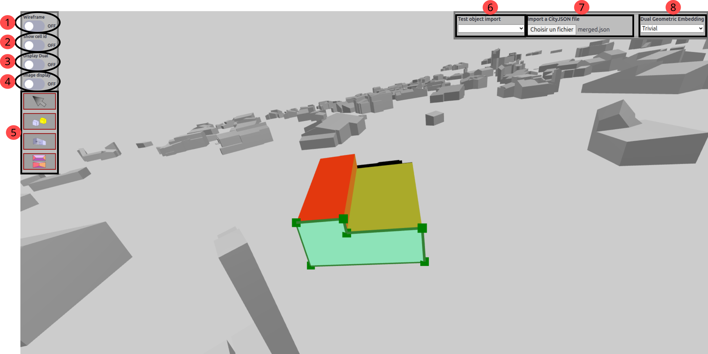

## 1 to 4 - Display features

- 1 - 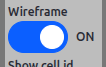 Displays the object with solid wireframes 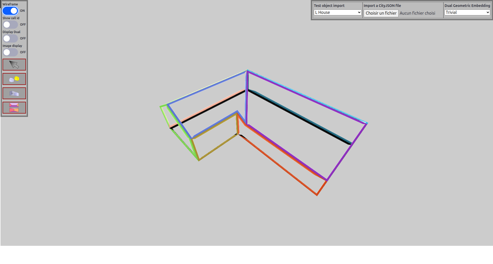
- 2 - 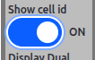 Displays the id of the faces, edges and vertices 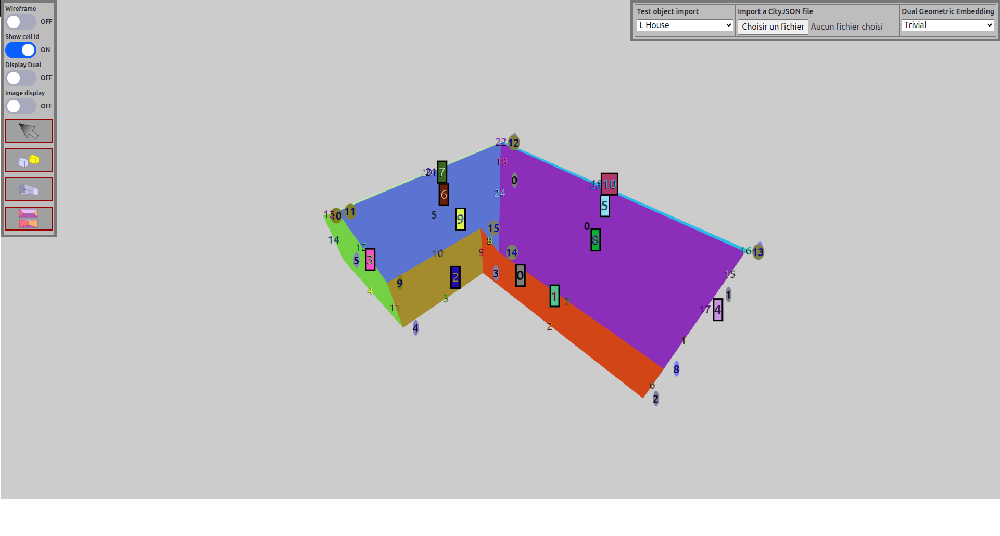 
- 3 - 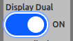 Displays the dual of the object in a new scene 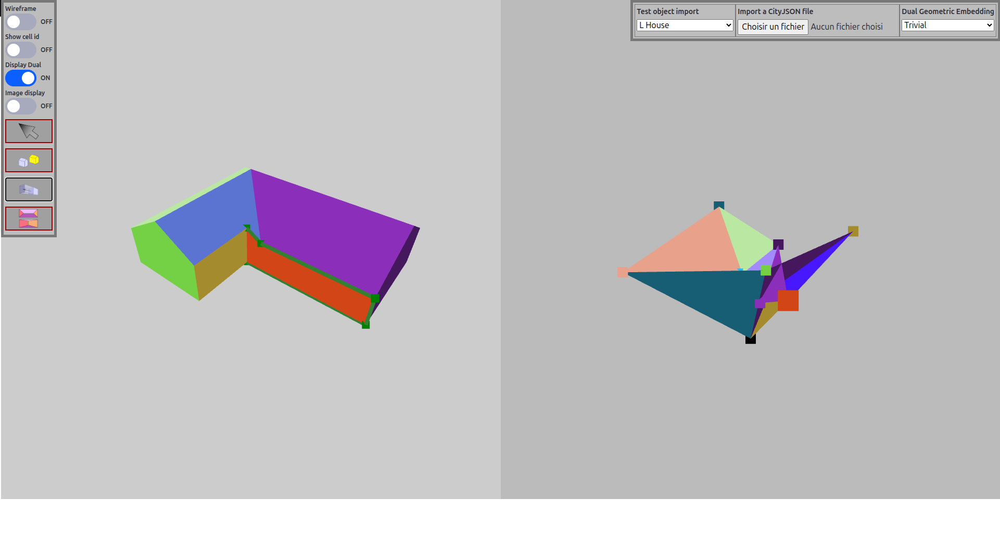
- 4 - Work in progress

## 5 - Tools

Two tools are proposed in this modeler : 

-  The **navigation** mode, to navigate in the scene.
-  The **selection** mode, to select a new mesh to modify.
-  The **Face-Shift**, which move a face along its normal.
-  The **Edge-Flip**, which changes the faces adjacent to an edge.

## 6-8 - Other features

- 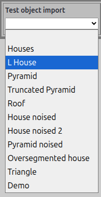 A set of test object that can be imported directly.
-  Import of CityJSON file.
- 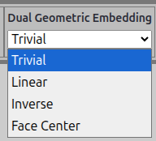 Selection of the geometrical embedding of the dual.

## Automatic processes

Four automatic processes, called topological events, can be triggered during the shift of a face, to resolve geometrical issues, like the non definition of a vertex position or the creation of self-intersections.

- 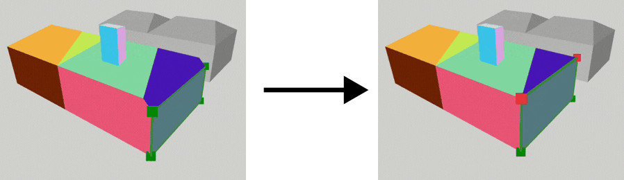 **Edge-Collapse** : Transform an edge into a vertex when its length become null.
- 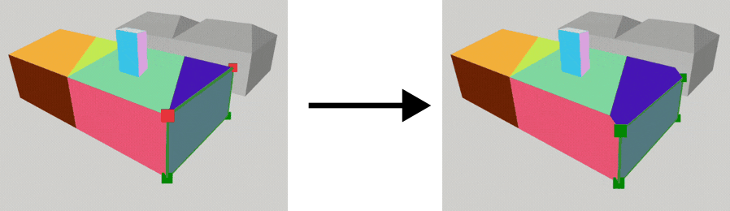 **Vertex-Split** : Transform a vertex into an edge if it is adjacent to more than 4 faces. 														(The vertex must be in the border of the shifted face).
- 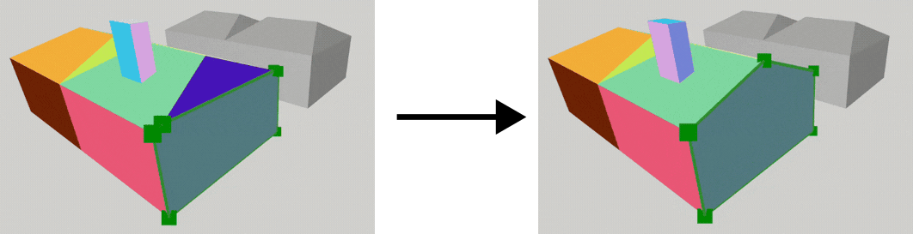 **Face-Collapse** : Transforms a face into an edge or a vertex if its area 																	becomes null.
- 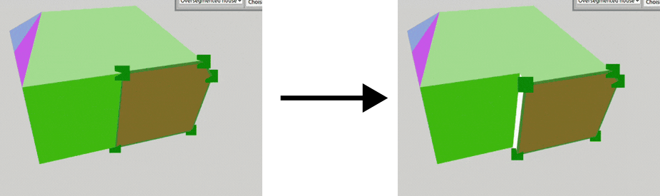 **Edge-Split** : Transforms an edge into a face if its adjacent faces are co-planar. 															(The edge must be in the border of the shifted face).

