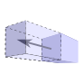
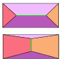
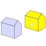

# Semi-automatic polyhedral modeler

This polyhedral modeler is based on the face shift and edge flip tools.

## Install

Before launching, you need to install the dependencies.

The dependencies are installed using node.

```bash
git clone https://github.com/LelouchLiBritania/Polyhedral-Modeler.git
cd Polyhedral-Modeler
npm install
```


## Launch local server

The local server can be launched with the following command :

```bash
npx vite
```


## Tools

Two tools are proposed in this modeler : 

-  The **Face-Shift**, which move a face along its normal.
-  The **Edge-Flip**, which changes the faces adjacent to an edge.

## Other Features

Other features are proposed in addition :

-  The **navigation** mode, to navigate in the scene.
-  The **selection** mode, to select a new mesh to modify.
  


## Automatic processes


## Package dependencies

|       **package**       | **version** |                           **doc**                            |
| :---------------------: | :---------: | :----------------------------------------------------------: |
|          three          |   0.151.3   |               [threejs](https://threejs.org/)                |
|         earcut          |    2.2.4    | [earcut_npm](https://www.npmjs.com/package/earcut?activeTab=readme) |
|       exactnumber       |    1.0.1    | [exactnumber_npm](https://www.npmjs.com/package/exactnumber) |
|        matrix-js        |    1.6.1    |   [matrix-js_npm](https://www.npmjs.com/package/matrix-js)   |
| cityjson-threejs-loader |    0.4.0    | [cityjson-threejs-loader_npm](https://www.npmjs.com/package/cityjson-threejs-loader) |
|         heap-js         |    2.5.0    |     [heap-js_npm](https://www.npmjs.com/package/heap-js)     |
|          vite           |    4.3.3    |        [vite_npm](https://www.npmjs.com/package/vite)        |
|   regenerator-runtime   |   0.13.9    | [regenerator-runtime_npm](https://www.npmjs.com/package/regenerator-runtime) |


## Publications


  


